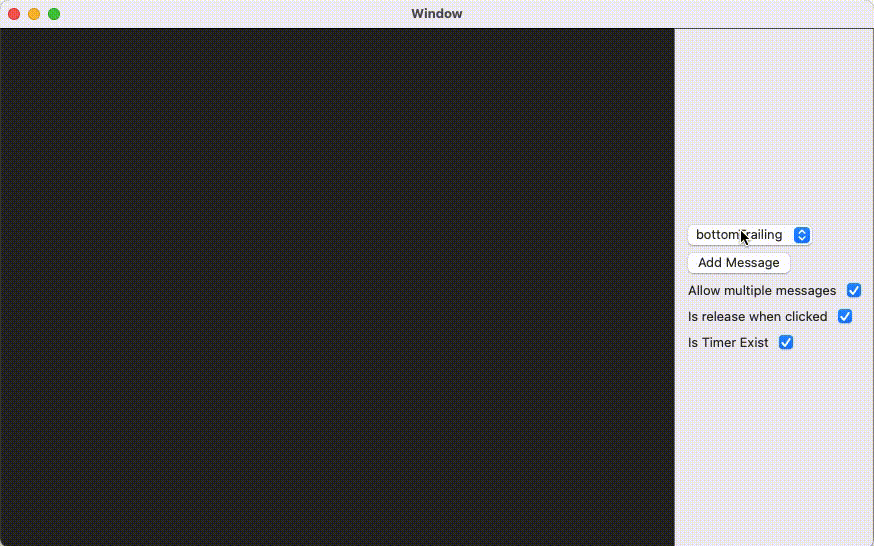
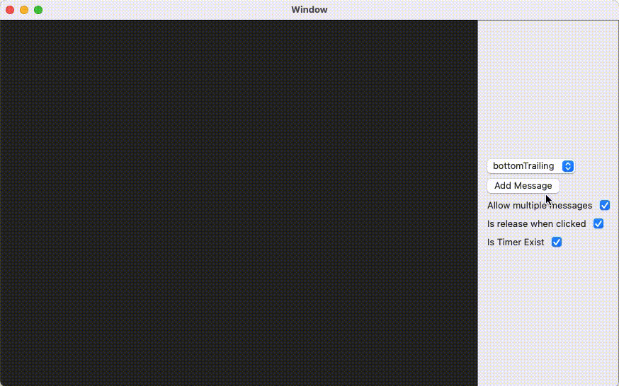

# VSwiftMessageBox

[](https://travis-ci.org/vong-e/VSwiftMessageBox)
[](https://cocoapods.org/pods/VSwiftMessageBox)
[](https://cocoapods.org/pods/VSwiftMessageBox)
[](https://cocoapods.org/pods/VSwiftMessageBox)


## Preview
### VSwiftMessgaeBox is message view for macOS applications.   
#### You can use it as toast or snackbar.
   
---   
#### VSwiftMessageBox supports 7 positions.   
#### Choose position what you want.
   
* TopLeading
* TopCenter
* TopTrailing
* Center
* BottomLeading
* BottomCenter
* BottomTraling    
---      
#### You want multiple messages?   
#### Let's do it!   
   
---    
#### Remove immediately?
#### Why not?
   
---    
#### Display until user interaction?   
#### Simple, remove timer.   
    
---     
#### Support Deem !, Also suppport dark mode!   
Just set color what you want.   
    

## Support Options
VSwiftMessageBox supports many options. Make your custom VSwiftMessageConfig.   

|            option            |        type        |                                           description                                              |
|:----------------------------:|:------------------:|:---------------------------------------------------------------------------------------------------|
|`messageBoxPosition`          |`MessageBoxPosition`| message display position.                                                                          |
|`messageSpacing`              |      `CGFloat`     | spacing between messages.                                                                          |
|`isAllowMultipleMessage`      |       `Bool`       | If true, allow multiple messages.<br>If false, only one message will display.                      |
|`isReleaseWhenClicked`        |       `Bool`       | If true, message release when clicked.<br>If false, message do not interact with your click event. |
|`isTimerExist`                |       `Bool`       | If true, message will remove after showing duration.<br>If false, message not effected by time.    |
|`showingDuration`             |      `Double`      | Message showing duration.                                                                          |
|`appearDuration`              |      `Double`      | Message appearing animation duration.                                                              |
|`disappearDuration`           |      `Double`      | Message disappearing animation duration.                                                           |
|`messageCornerRadius`         |      `CGFloat`     | Message's corner radius.                                                                           |
|`messageOpacity`              |       `Float`      | Message's view opacity.                                                                            |
|`deemColor`                   |      `NSColor`     | Message's deem color.                                                                              |
|`verticalMargin`              |      `CGFloat`     | Message's vertical margin.                                                                         |
|`horizontalMargin`            |      `CGFloat`     | Message's horizontal margin.                                                                       |


## Example

To run the example project, clone the repo, and run `pod install` from the Example directory first.

## Requirements

## Installation

VSwiftMessageBox is available through [CocoaPods](https://cocoapods.org). To install
it, simply add the following line to your Podfile:

```ruby
pod 'VSwiftMessageBox'
```

## Author

vong-e, sinkim123321@gmail.com

## License

VSwiftMessageBox is available under the MIT license. See the LICENSE file for more info.
